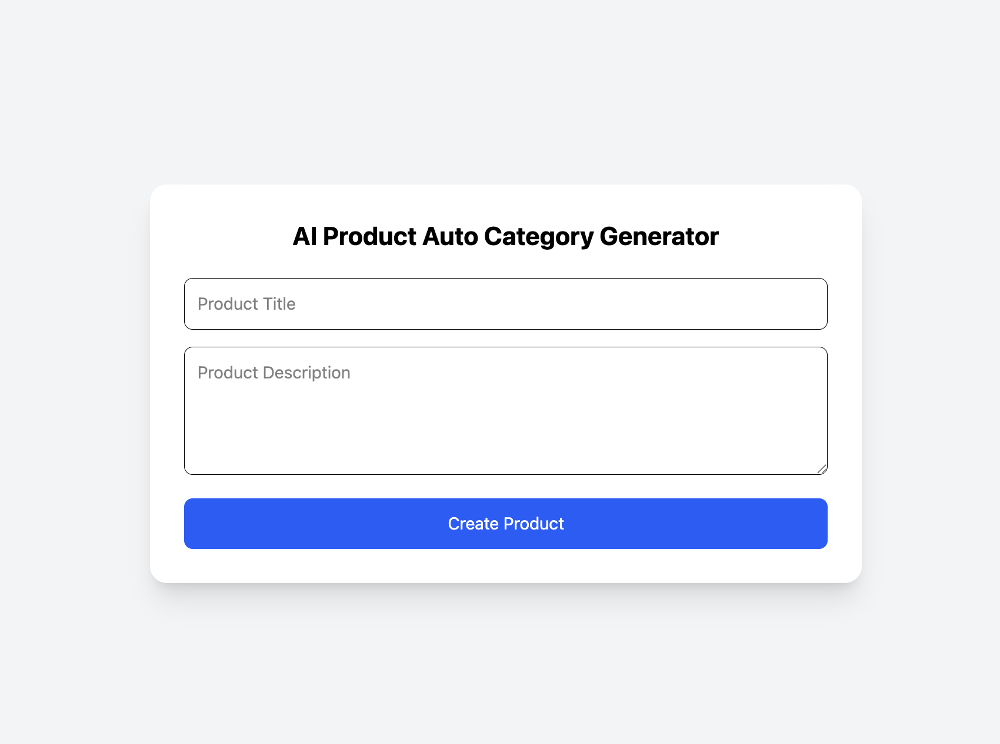
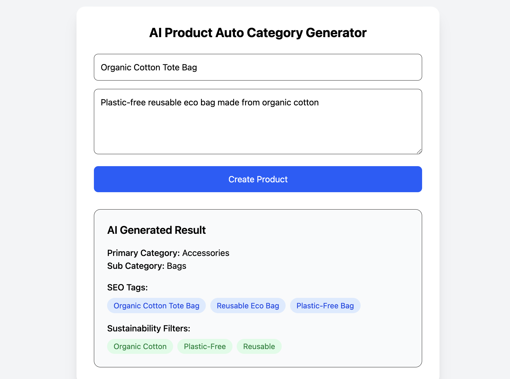

# AI Product Auto Category Generator

## Overview
This project is a JavaScript application that utilizes artificial intelligence to automatically categorize products based on their descriptions and features. This tool aims to simplify product management and enhance user experience by ensuring accurate and relevant categorization.






## Features
- **AI-Powered Categorization:** Uses machine learning algorithms to categorize products automatically.
- **Customizable Categories:** Users can define custom categories to suit their needs.
- **User-Friendly Interface:** Simple and intuitive UI for easy navigation and management.
- **Support for Multiple Product Types:** Works with various product categories, ensuring flexibility for different industries.
- **Real-time Analytics:** Provides insights into product categorization effectiveness and user interaction.

## Tech Stack
- **Frontend:** React.js
- **Backend:** Node.js with Express
- **Database:** MongoDB
- **AI:** OpenRouter Api For efficient result
- **Deployment:** Heroku or Vercel

## Installation
1. Clone the repository:
   ```bash
   git clone https://github.com/CodeByAfroj/AI_Product_Auto_Category_Generator.git
   ```
2. Navigate to the project directory:
   ```bash
   cd AI_Product_Auto_Category_Generator
   ```
3. Install the dependencies:
   ```bash
   npm install
   ```
4. Set up your environment variables in a `.env` file as per the `.env.example` file provided.

## Usage
1. Start the server:
   ```bash
   npm start
   ```
2. Access the application at `http://localhost:3000` in your web browser.
3. Use the frontend interface to add products and see automatic categorization in action.

## API Documentation
- **POST /api/products**: Add a new product for categorization.

## Project Structure
```
AI_Product_Auto_Category_Generator/
├── client/                    # Frontend application
├── server/                    # Backend application
├── models/                    # Database models
├── routes/                    # API routes
├── controllers/               # Request handlers
├── utils/                     # Utility functions
├── .env.example               # Example environment variables
└── README.md                  # Project documentation
```
